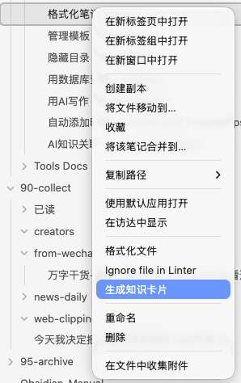
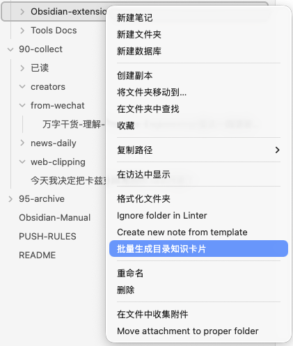

# Lite LLM Wiki - Obsidian知识卡片生成插件

一款基于大语言模型的Obsidian插件，可以自动将Markdown文件转换为标准化的知识卡片和实体页面，帮助你快速构建个人知识库。

## ✨ 灵感来源
本插件的核心方法来自AI大神Andrej Karpathy（前特斯拉AI负责人、OpenAI创始成员）提出的LLM知识库构建方案，原文可见：[Karpathy's LLM Wiki Gist](https://gist.github.com/karpathy/442a6bf555914893e9891c11519de94f)

我们在原方法基础上做了Obsidian插件化适配，加入了批量处理、实体关联、自定义提示词等实用功能，让每个人都能零代码一键使用这套高效的知识管理方法。

## ✨ 功能特性

### 🎯 核心功能
- **单文件生成**: 右键任意Markdown文件，一键生成知识卡片
- **批量生成**: 右键任意文件夹，批量处理目录下所有Markdown文件
- **自动实体提取**: 生成卡片后自动识别并提取关联实体，生成实体页面
- **实体标准化**: 自动合并同义词，统一实体命名规范
- **跨平台兼容**: 支持桌面端和移动端，完全基于Obsidian官方API实现

### ⚙️ 高级功能
- **自定义提示词**: 支持自定义卡片生成和实体清洗的提示词模板
- **配置同步**: 所有配置自动同步到Obsidian云端，跨设备使用无需重复配置
- **自动覆盖**: 可配置是否自动覆盖已存在的卡片文件
- **生成记录**: 完整的生成历史记录，支持回溯和重新生成
- **付费激活**: 支持非对称加密激活码验证，永久解锁高级功能

### 🖼️ 使用截图
右键任意Markdown文件，一键生成知识卡片：


右键任意文件夹，批量生成目录下所有笔记的知识卡片：


## 🚀 快速开始

### 1. 安装插件
将插件文件夹放入你的Obsidian插件目录：
```
.obsidian/plugins/lite-llm-wiki
```
然后在Obsidian设置中启用插件。

### 2. 配置API
打开插件设置页面，配置你的大语言模型API信息：
- **Base URL**: API服务地址（默认：https://api.longcat.chat/openai）
- **API Key**: 你的API密钥
- **模型ID**: 要使用的模型（默认：LongCat-Flash-Chat）

点击"验证API配置"按钮确认配置正确。

### 3. 配置目录
设置默认的目录路径：
- **默认输入目录**: 存放要处理的Markdown文件的目录
- **知识卡片输出目录**: 生成的知识卡片保存位置
- **实体页面输出目录**: 生成的实体页面保存位置

### 4. 开始使用
- 右键任意Markdown文件，选择"生成知识卡片"
- 右键任意文件夹，选择"批量生成目录知识卡片"
- 或使用命令面板中的相关命令

## 📋 功能说明

### 知识卡片格式
生成的知识卡片包含以下部分：
```markdown
---
创建时间: 2024-04-21 12:00
修改时间: 2024-04-21 12:00
---

# 卡片名称

## 核心定义
卡片内容的核心定义

## 关键要点
- 要点1
- 要点2
- 要点3
- 要点4

## 作者情绪
原文作者的立场和倾向

## 关联实体
[[实体1]], [[实体2]], [[实体3]]

## 原文地址
[[原文件名.md]]
```

### 实体页面格式
生成的实体页面包含以下部分：
```markdown
---
创建时间: 2024-04-21 12:00
修改时间: 2024-04-21 12:00
---

# 实体名称

## 基本信息
- **类型**: 实体
- **创建时间**: 2024-04-21 12:00

## 关联知识卡片

## 描述
```

## 🔧 开发说明

### 技术栈
- TypeScript - 类型安全的开发语言
- Obsidian官方API - 确保100%兼容所有平台
- 仅依赖2个第三方库:
  - axios - HTTP请求库
  - crypto-js - 加密库，用于激活码验证

### 项目结构
```
lite-llm-wiki/
├── main.ts                 # 插件主入口
├── types.ts                # 类型定义
├── config/
│   └── defaultSettings.ts  # 默认配置
├── services/
│   ├── llmService.ts       # LLM API调用服务
│   ├── cardParserService.ts # 卡片解析服务
│   └── cardGenerationService.ts # 生成流程协调服务
├── manifest.json           # 插件清单
├── package.json            # 项目依赖
├── tsconfig.json           # TypeScript配置
└── rollup.config.js        # 打包配置
```

### 编译运行
```bash
# 安装依赖
npm install

# 开发模式（自动编译）
npm run dev

# 生产构建
npm run build
```

## 📄 许可证
MIT License
